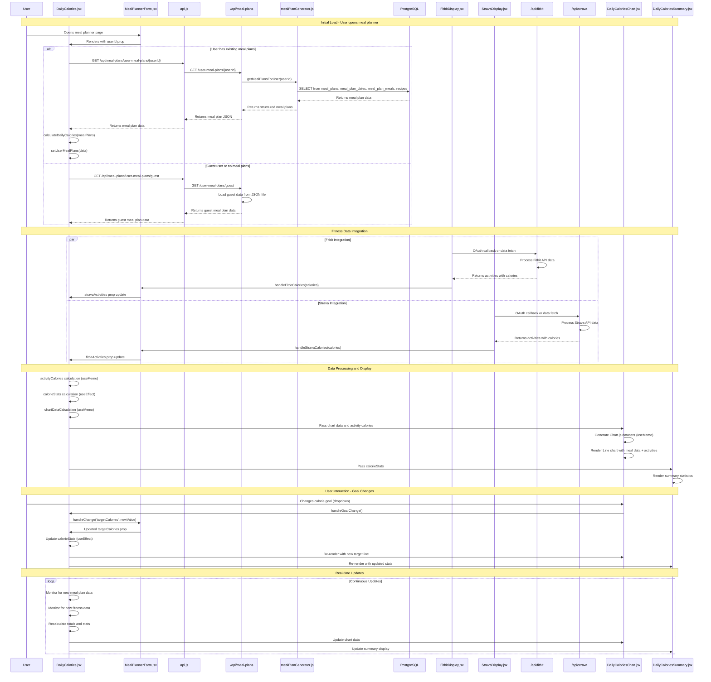

# DailyCalories Data Flow Sequence Diagram

## Overview
This sequence diagram shows the complete data flow for the DailyCalories components, including how they retrieve meal plan data from the database and integrate with fitness tracking data.

## Files Involved

### Frontend Components
- `client/src/components/DailyCalories.jsx` - Main component orchestrating data flow
- `client/src/components/DailyCaloriesChart.jsx` - Chart visualization component
- `client/src/components/DailyCaloriesSummary.jsx` - Summary statistics component
- `client/src/components/MealPlannerForm.jsx` - Parent component that provides data
- `client/src/components/FitbitDisplay.jsx` - Fitness data integration
- `client/src/components/StravaDisplay.jsx` - Fitness data integration

### Backend Services
- `client/src/services/api.js` - API client configuration
- `server/routes/mealPlan.js` - Meal plan API endpoints
- `server/services/mealPlanGenerator.js` - Database operations and meal plan logic
- `server/routes/strava.js` - Strava API integration
- `server/routes/fitbit.js` - Fitbit API integration

### Database
- `server/db/schema.sql` - Database schema
- `server/services/database.js` - Database connection service

## Sequence Diagram



## Database Schema for Meal Plans

The meal plan data is stored across several tables:

```sql
-- Main meal plan container
CREATE TABLE meal_plans (
  id SERIAL PRIMARY KEY,
  user_id INTEGER NOT NULL,
  title TEXT NOT NULL,
  start_date DATE,
  end_date DATE,
  created_at TIMESTAMP DEFAULT CURRENT_TIMESTAMP
);

-- Individual dates within a meal plan
CREATE TABLE meal_plan_dates (
  id SERIAL PRIMARY KEY,
  meal_plan_id INTEGER REFERENCES meal_plans(id),
  date DATE NOT NULL
);

-- Meals for each date
CREATE TABLE meal_plan_meals (
  id SERIAL PRIMARY KEY,
  meal_plan_date_id INTEGER REFERENCES meal_plan_dates(id),
  meal_type TEXT NOT NULL, -- 'breakfast', 'lunch', 'dinner'
  recipe_id INTEGER REFERENCES recipes(id),
  planned_macros JSONB, -- Stores nutrition data
  planned_image_url TEXT
);

-- User notes for meals
CREATE TABLE meal_plan_meal_notes (
  id SERIAL PRIMARY KEY,
  meal_plan_meal_id INTEGER REFERENCES meal_plan_meals(id),
  user_rating INTEGER,
  user_comment TEXT,
  created_at TIMESTAMP DEFAULT CURRENT_TIMESTAMP
);
```

## Key Data Flow Points

1. **Initial Load**: DailyCalories checks for userId and fetches existing meal plans from database
2. **Guest Mode**: Falls back to static JSON data for demo purposes
3. **Fitness Integration**: Real-time calorie data from Fitbit/Strava APIs
4. **Data Processing**: Calculates daily totals, activity calories, and net calorie balance
5. **Visualization**: Chart shows meal calories vs target, with activity data overlaid
6. **Real-time Updates**: Components react to changes in meal plans and fitness data

## Error Handling

- Database connection failures fall back to guest data
- Missing fitness data shows zero calories burned
- Invalid meal plan data uses default values
- API failures are logged and handled gracefully

This architecture provides a robust, real-time calorie tracking system that integrates meal planning with fitness data for comprehensive nutrition management. 