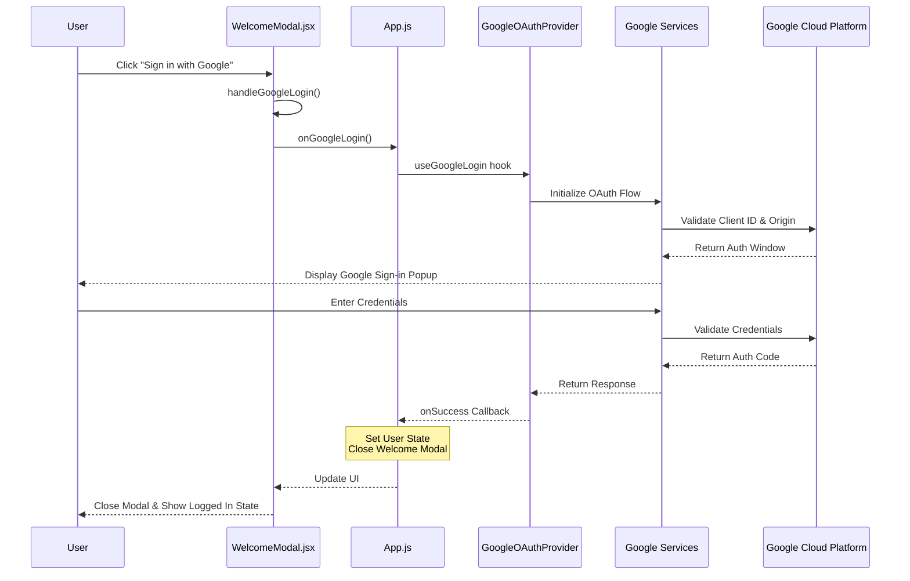

# Google OAuth Implementation Documentation

## Overview

This document details the implementation of Google OAuth authentication in the Meal Planner AI application. The implementation uses `@react-oauth/google` for handling the OAuth flow and follows OAuth 2.0 best practices.

## Sequence Diagram



## Component Implementation Details

### 1. Root Configuration (index.js)
```jsx
// Wraps the entire app with Google OAuth Provider
<GoogleOAuthProvider 
  clientId="424080544040-dacl3vj1nf21ku2qnfham61180cjuegp.apps.googleusercontent.com"
  onScriptLoadError={() => console.error('Google Script failed to load')}
  onScriptLoadSuccess={() => console.log('Google Script loaded successfully')}
>
  <App />
</GoogleOAuthProvider>
```

**Responsibilities:**
- Initializes the Google OAuth context
- Provides the client ID to all child components
- Handles script loading events

### 2. Main Application (App.js)
```jsx
// Manages the authentication state and Google login logic
const [user, setUser] = useState(null);
const [showWelcome, setShowWelcome] = useState(true);

const handleGoogleLogin = useGoogleLogin({
  onSuccess: async (response) => {
    console.log('Google login response:', response);
    setUser(response);
    setShowWelcome(false);
  },
  onError: (error) => console.error('Login Failed:', error),
  scope: 'email profile',
  flow: 'auth-code',
  ux_mode: 'popup'
});

// Renders the WelcomeModal with necessary props
{showWelcome && (
  <WelcomeModal 
    onClose={handleWelcomeClose}
    onGoogleLogin={handleGoogleLogin}
  />
)}
```

**Responsibilities:**
- Manages the main application state
- Configures the Google login flow
- Handles successful login and error cases
- Controls the visibility of the welcome modal

### 3. Welcome Modal (WelcomeModal.jsx)
```jsx
const WelcomeModal = ({ onClose, onGoogleLogin }) => {
  const [isLoading, setIsLoading] = useState(false);
  const [error, setError] = useState(null);

  const handleGoogleLogin = () => {
    if (typeof onGoogleLogin !== 'function') {
      setError('Authentication configuration error');
      return;
    }

    try {
      setIsLoading(true);
      setError(null);
      onGoogleLogin();
    } catch (error) {
      setError('Failed to authenticate with Google');
    } finally {
      setIsLoading(false);
    }
  };

  // Render Google sign-in button
  <button
    onClick={handleGoogleLogin}
    disabled={isLoading}
    className="..."
  >
    {isLoading ? <LoadingSpinner /> : "Sign in with Google"}
  </button>
}
```

**Responsibilities:**
- Presents the login interface to the user
- Handles the click event for Google sign-in
- Manages loading and error states
- Shows feedback to the user

## Google Cloud Platform Configuration

### Required Settings
```plaintext
Authorized JavaScript origins:
http://localhost:3000

Authorized redirect URIs:
http://localhost:3000
http://localhost:3000/
http://localhost:3000/callback
http://localhost:3000/oauth2callback
```

**Configuration Responsibilities:**
- Configures allowed origins and redirect URIs
- Ensures security by validating request origins
- Manages OAuth client credentials

## Authentication Flow

### 1. Initialization
- `index.js` loads the Google OAuth provider
- `App.js` initializes with no user and showing welcome modal
- `WelcomeModal.jsx` renders with sign-in button

### 2. User Interaction
- User clicks "Sign in with Google" button
- `WelcomeModal` calls `handleGoogleLogin`
- Sets loading state and clears any previous errors

### 3. OAuth Flow
- `App.js` triggers the Google OAuth popup
- Google validates the client ID and origin
- User sees Google sign-in popup
- User enters credentials

### 4. Authentication
- Google validates credentials
- Returns authentication code/token
- `onSuccess` callback is triggered in `App.js`
- User state is updated
- Welcome modal is closed

### 5. Post-Authentication
- App updates to show logged-in state
- User can now access authenticated features
- Session is maintained until logout

## Security Features

1. **Origin Validation**
   - Strict validation through Google Cloud Platform
   - Prevents unauthorized domains from using the OAuth client

2. **Popup Authentication**
   - More secure than redirect-based flow
   - Prevents certain types of phishing attacks

3. **Error Handling**
   - Comprehensive error handling at each step
   - Clear user feedback for all error states

4. **State Management**
   - Loading states to prevent multiple attempts
   - Clear separation of concerns between components

5. **Best Practices**
   - Follows OAuth 2.0 security guidelines
   - Implements proper scope handling
   - Uses secure configuration settings

## Troubleshooting

Common issues and solutions:

1. **redirect_uri_mismatch Error**
   - Verify authorized origins in Google Cloud Console
   - Check for exact URL matches including protocol

2. **Script Loading Errors**
   - Check network connectivity
   - Verify client ID configuration
   - Check browser console for detailed errors

3. **Popup Blocked**
   - Enable popups for the domain
   - Check browser settings
   - Consider using redirect mode as fallback

## Dependencies

Required packages:
```json
{
  "@react-oauth/google": "^0.12.2",
  "jwt-decode": "^4.0.0"
}
```

## Additional Resources

- [Google OAuth 2.0 Documentation](https://developers.google.com/identity/protocols/oauth2)
- [@react-oauth/google Documentation](https://www.npmjs.com/package/@react-oauth/google)
- [Google Cloud Console](https://console.cloud.google.com) 